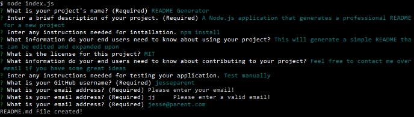
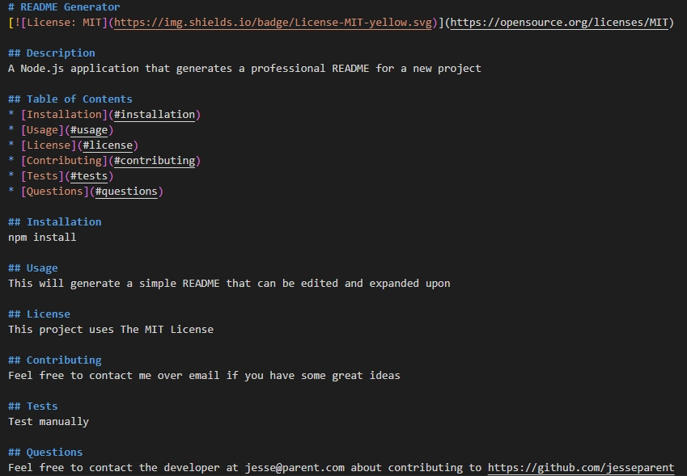
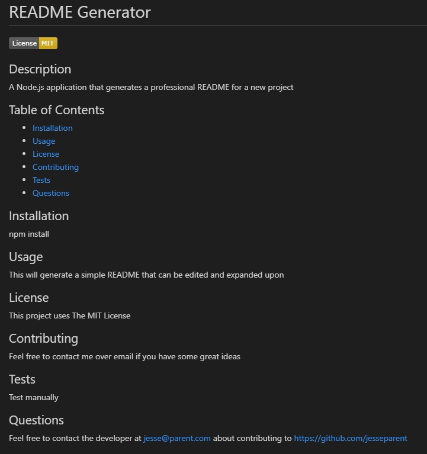

# README Generator

## Description 
A Node.js application that generates a professional README for a new project

## Table of Contents
* [Installation](#installation)
* [Usage](#usage)
* [License](#license)
* [Contributing](#contributing)
* [Tests](#tests)
* [Questions](#questions)
* [Screenshots](#screenshots)
* [Video](#video)

## Installation
npm install

## Usage 
This will generate a simple README that can be edited and expanded upon. Use "node index.js" to run the file. README will be produced in the "dist/" folder.

## License
This project uses The MIT License

## Contributing
Feel free to contact me over email if you have some great ideas

## Tests
Test manually

## Questions
Feel free to contact the developer at jesse@parent.com about contributing to https://github.com/jesseparent

## Screenshots
The user entering data into the command line interface:

The markdown of the produced README.md file:

The README.md as rendered:

## Video
A video demo of this project can be found at https://screencast-o-matic.com/watch/cYQuVcdpOo